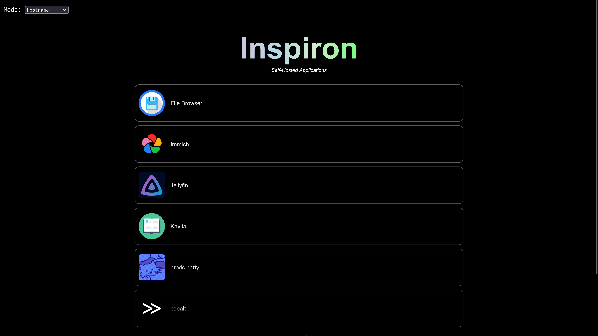

# dlauncher

[prods.party](https://github.com/rahmed29/prods.party) repurposed into a dead simple app launcher / dashboard / directory for self-hosted
applications running on my Dell Inspiron 3847 that I use as a home server.

dlauncher lets the user decide how links to their applications should be displayed, they can choose from 3 different options:

1. One link, `private-ip:port`, this is the default and is ideal if you have subnet routing enabled on your Tailnet
2. One link, `tailscale-ip:port`
3. One link, `server-hostname:port`, this works if your device can resolve the server's hostname
4. One link, that dyanmically routes your request to either of the first 2 based on your connecting IP. This is useful if you do not have subnet routing enabled on your Tailnet. If you are connecting to the launcher using your server's private IP or Tailscale IP, this option is of no use.
5. Two links, one for `private-ip:port` and one for `tailscale-ip:port`. This is useful if you do not have subnet routing enabled on your tailnet and are using a VPN or proxy that masks your connecting IP (iCloud Private Relay, etc.)

Just run `deno -P server.js` and you'll be good to go! Of course, if you're not me you'll need to modify the `routes` object in `server.js`.
